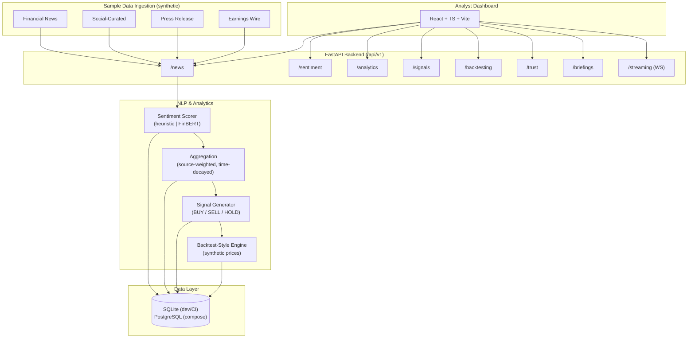

# Atlas — Market Sentiment & Trading Intelligence Platform

**A student-built FinTech analytics platform that ingests sample market news, scores ticker-level sentiment with an NLP pipeline, aggregates time-series signals, and runs paper-trade style simulation and backtest-style analytics on a React dashboard — all on synthetic/sample data.**

[**🖼 UI / Portfolio Design Preview →**](https://www.perplexity.ai/computer/a/atlas-preview-project-2-of-9-lCA5DWRgQoa4AN6VYPXAUQ)

> ⚠️ **Financial Disclaimer — Read first.**
> Atlas is an **educational portfolio project**. It is **NOT financial advice**, **NOT investment advice**, **NOT a trading system**, and **NOT a recommendation to buy or sell any security**.
>
> - 🚫 **No real trades are executed.** The "paper-trade" module is an in-memory portfolio simulation against **synthetic** prices — it is **not** connected to Alpaca, Interactive Brokers, Robinhood, or any other brokerage.
> - 🚫 **No live market data.** All news, prices, and timestamps are **synthetic / sample fixtures** generated for reproducibility.
> - 🚫 **No live news API.** Headlines are hand-written or programmatically generated.
> - ✅ Use this code to evaluate engineering skills, not as a basis for any real-world financial decision.

---

## ⚡ Recruiter Demo in 2 Minutes

> Goal: from `git clone` to a live API + interactive Swagger UI + a backtest-style result in under 2 minutes, with no API keys, no model downloads, and no external services.

```bash
git clone https://github.com/RyanJBush/Real-time-market-sentiment-and-trading-intelligence-platform.git
cd Real-time-market-sentiment-and-trading-intelligence-platform

# 1. Install Python deps (Python 3.11+)
cd backend && pip install -r requirements.txt && cd ..

# 2. One-shot end-to-end demo: ingest → score → aggregate → signal → backtest
bash scripts/run_demo.sh
```

That single script boots the FastAPI server on `http://localhost:8000`, ingests synthetic news for AAPL/TSLA/NVDA, scores sentiment with the deterministic heuristic NLP, generates BUY/SELL/HOLD signals, and prints a backtest-style historical comparison — all in JSON, all reproducible.

Want to click through the UI? In a second terminal:

```bash
cd frontend && npm ci && npm run dev   # → http://localhost:5173
```

Prefer Docker?

```bash
docker compose up --build              # Backend on :8000, Frontend on :5173
```

The full walkthrough lives in [`docs/demo-runbook.md`](docs/demo-runbook.md).

---

## 📋 Project / Technical Snapshot

> Every claim below is verified against the actual repo state (`git ls-files`, `pytest -q`, `npm run build`).

| | |
|---|---|
| **Project name** | Atlas — Market Sentiment & Trading Intelligence Platform |
| **Type** | Full-stack FinTech / NLP portfolio project |
| **Status** | Active portfolio project — not deployed to production |
| **Builder** | Ryan Bush — University of Maryland, Information Science (General Business minor; previous Electrical Engineering coursework) |
| **Backend** | Python 3.11+, FastAPI, SQLAlchemy 2.x, Pydantic v2, pandas, NumPy |
| **NLP** | Deterministic finance-tuned lexicon heuristic (default) · optional Transformers / FinBERT backend |
| **Frontend** | React + Vite + TypeScript + Tailwind |
| **Database** | SQLite (dev / CI / tests) · PostgreSQL via Docker Compose |
| **API routers** | 11 versioned routers under `/api/v1` (news, sentiment, analytics, signals, backtesting, trust, briefings, jobs, replay, streaming, health) |
| **Tests** | 22 pytest tests, all passing (in-memory SQLite, heuristic NLP) |
| **CI** | GitHub Actions — ruff lint + pytest + frontend production build on every push & PR |
| **Containers** | `backend/Dockerfile`, `frontend/Dockerfile`, `docker-compose.yml` |
| **Data** | 100% synthetic / sample fixtures — no live market feed, no broker, no real news API |
| **Live deployment** | None. Local-only. UI Preview link is design/portfolio only. |
| **License** | MIT |

---

## 🎯 What This Project Demonstrates

This project is designed to show recruiters and hiring managers the **end-to-end engineering shape** of a FinTech analytics product, on a scope I can fully own and reproduce.

- **Full-stack delivery** — REST + WebSocket API, SQL schema, React dashboard, Docker Compose, CI — built and wired together as one system, not a notebook.
- **NLP engineering** — a `SentimentProvider` Protocol with two interchangeable backends (deterministic finance lexicon + optional FinBERT), plus topic / event / entity-level extraction layered on top.
- **Time-series & analytics thinking** — source-weighted, time-decayed rolling aggregates per ticker; BUY/SELL/HOLD signal generation with explicit thresholds, min-confidence gates, and rationale strings.
- **Honest evaluation** — a backtest-style historical comparison that produces expectancy, confusion matrix, return correlation, threshold sweeps, and named scenarios — with an explicit `assumptions` block on every response.
- **Explainability / trust** — per-signal top-contributing articles, persisted analyst annotations, and an audit log.
- **API design discipline** — versioned `/api/v1` prefix, Pydantic v2 schemas, request-ID middleware, structured logging, `/health` and `/readiness` probes, auto-generated OpenAPI / Swagger UI.
- **Test discipline** — 22 end-to-end pytest tests covering the full pipeline, hermetic via in-memory SQLite, run in CI.
- **Reproducibility** — deterministic heuristic NLP and synthetic fixtures by default so any recruiter can `git clone` and get identical output without API keys.
- **Documentation discipline** — `README.md`, `docs/architecture.md`, `docs/api.md`, `docs/demo-runbook.md`, `docs/resume-bullets.md`, `docs/screenshots/README.md` — written for someone seeing the repo cold.

---

## 📸 Screenshots / Demo

Recruiter-friendly screenshot set lives in `docs/screenshots/`. The current capture plan covers the demo story end-to-end:

| # | Screenshot | What it shows |
|---|---|---|
| 1 | **Dashboard / Ticker overview** | KPI cards (sentiment index, active signals, top movers, watchlist alerts), trend chart, event tape. |
| 2 | **Sentiment news feed** | Per-article rows with ticker, source, headline, sentiment label/score/confidence, and the model used. |
| 3 | **Signal output panel** | Ticker view with BUY/SELL/HOLD signal, weighted score, threshold inputs, rationale, and top contributing articles. |
| 4 | **Backtest-style result** | Historical comparison JSON or chart — per-day rows, expectancy, confusion matrix, return correlation, `assumptions` block. |
| 5 | **API docs (Swagger UI)** | `http://localhost:8000/docs` showing the 11 routers under `/api/v1`. |

See [`docs/screenshots/README.md`](docs/screenshots/README.md) for exact capture instructions (URL, viewport, recommended file names). Captures themselves are not committed to the repo to keep diffs reviewable; add them locally when running the demo.

---

## ⭐ Key Technical Highlights

- **Dual NLP backend behind a Protocol** — `heuristic` provider (zero downloads, fully deterministic, finance-tuned lexicon) and an optional `transformers` provider that loads FinBERT lazily. Same input contract, same output schema.
- **Finance-aware confidence calibration** — raw scores are re-weighted by counts of finance-positive, finance-negative, and uncertainty terms before being emitted as confidence.
- **Topic / event / entity extraction** — keyword routing into `earnings`, `macro`, `product`, `legal`, `m_and_a`; uppercase-token entity sweep with directional projection; topic-hash `cluster_id` for downstream grouping.
- **Source-weighted, time-decayed aggregation** — `SENTIMENT_HALF_LIFE_HOURS` controls decay; per-source weights configurable; outputs weighted score, breadth, volatility, and trend per ticker.
- **Explainable signals** — every BUY/SELL/HOLD carries a rationale string and a list of top-contributing articles; a separate `/trust/signals/{ticker}/audit` endpoint exposes the per-signal audit trail.
- **Backtest-style historical comparison** — walks scored sentiment vs synthetic forward returns; emits expectancy, average return per trade, cumulative proxy return vs benchmark, return correlation, and a signal-vs-realized confusion matrix.
- **Threshold tuning and named scenarios** — `/backtesting/tune` performs a grid sweep; `/backtesting/scenarios/{ticker}` runs conservative / balanced / aggressive presets on the same window.
- **Paper-trade style simulation** — an in-memory portfolio NAV simulation against synthetic prices, with configurable initial cash and position sizing. **Not** real trading, **not** broker-connected.
- **Real-time layer** — a WebSocket streaming endpoint (`/api/v1/streaming/ws`) plus a deterministic event replay endpoint for offline demos.
- **Resilient frontend** — the React dashboard has a built-in mock-data fallback so the UI is still meaningful if the backend is offline (useful for static demo captures).
- **CI hygiene** — `ruff check` + `pytest` for the backend and `npm run build` for the frontend run on every PR via GitHub Actions.

---

## 🛠️ Tech Stack

| Layer | Technology |
|---|---|
| Backend API | FastAPI, SQLAlchemy 2.x, Pydantic v2 |
| NLP | Finance-tuned lexicon heuristic (default) · optional Transformers / FinBERT |
| Analytics | pandas, NumPy |
| Storage | SQLite for local / dev / CI · PostgreSQL via Docker Compose |
| Frontend | React, Vite, TypeScript, Tailwind |
| Tests | pytest, FastAPI TestClient, in-memory SQLite (22 tests) |
| Tooling | ruff · GitHub Actions · Docker Compose · Makefile |

---

## 🏗️ Architecture



Full component-level write-up: [`docs/architecture.md`](docs/architecture.md).

---

## 📁 Repository Structure

```
.
├── backend/                  # FastAPI app
│   ├── app/
│   │   ├── api/v1/routers/   # 11 routers: news, sentiment, analytics, signals,
│   │   │                     #             backtesting, trust, briefings, jobs,
│   │   │                     #             replay, streaming, (health)
│   │   ├── services/         # nlp, aggregation, signal, backtest, news, etc.
│   │   ├── models/           # SQLAlchemy: news, sentiment, signal, annotation, ingestion, price
│   │   ├── schemas/          # Pydantic v2 request/response DTOs
│   │   ├── core/             # config, logging, middleware
│   │   └── db/               # engine, session, base
│   ├── scripts/seed_demo.py  # deterministic demo seeding
│   ├── tests/                # pytest (22 tests, in-memory SQLite)
│   ├── requirements.txt
│   └── Dockerfile
├── frontend/                 # React + Vite + TypeScript dashboard
├── data/                     # Synthetic news + price fixtures (see data/README.md)
├── docs/
│   ├── architecture.md       # Component & flow detail
│   ├── api.md                # API reference with curl examples
│   ├── demo-runbook.md       # Step-by-step recruiter demo flow
│   ├── resume-bullets.md     # ATS-ready resume bullets
│   ├── screenshots/README.md # Screenshot capture guide
│   └── codebase-overview.md
├── scripts/
│   └── run_demo.sh           # One-shot end-to-end local demo
├── .github/workflows/ci.yml
├── docker-compose.yml
├── Makefile
└── README.md
```

---

## 🚀 How to Run Locally

### Prerequisites

- Python 3.11+
- Node.js 18+ (for the frontend)
- Optional: Docker + Docker Compose (for the full-stack path)

### Option A — Local Python (fastest, no Docker)

```bash
# 1. Install backend deps
cd backend
pip install -r requirements.txt

# 2. Run tests (uses in-memory SQLite, deterministic heuristic NLP — should print "22 passed")
NLP_PROVIDER=heuristic DATABASE_URL="sqlite:///:memory:" PYTHONPATH=. pytest -q

# 3. Run the API locally against an on-disk SQLite file
NLP_PROVIDER=heuristic DATABASE_URL="sqlite:///./atlas.db" AUTO_CREATE_TABLES=true \
  PYTHONPATH=. uvicorn app.main:app --reload --port 8000

# 4. Open the auto-generated API docs
open http://localhost:8000/docs
```

### Option B — Full stack via Docker Compose

```bash
docker compose up --build
# Backend (Swagger):  http://localhost:8000/docs
# Frontend (Vite):    http://localhost:5173
```

### Option C — Frontend dev server only

```bash
cd frontend
npm ci && npm run dev
```

> The frontend ships with a mock-data fallback layer, so the UI is still navigable even if the backend is offline.

### One-shot end-to-end demo

```bash
bash scripts/run_demo.sh
```

This script handles steps 1–4 above and pipes a full ingest → score → aggregate → signal → backtest flow through the API.

---

## ⚙️ Environment Variables

Copy `backend/.env.example` to `backend/.env` and adjust as needed:

| Variable | Default | Purpose |
|---|---|---|
| `APP_NAME` | `Atlas API` | App display name |
| `API_V1_PREFIX` | `/api/v1` | API base prefix |
| `DATABASE_URL` | _(empty → builds Postgres URL)_ | Override with `sqlite:///./atlas.db` for local |
| `NLP_PROVIDER` | `heuristic` | `heuristic` (deterministic) or `transformers` (FinBERT) |
| `NLP_MODEL_NAME` | `ProsusAI/finbert` | HuggingFace model id when `transformers` is selected |
| `AUTO_CREATE_TABLES` | `false` | Auto-create SQLAlchemy tables on startup (dev only) |
| `DEFAULT_BUY_THRESHOLD` | `0.25` | Default signal threshold |
| `DEFAULT_SELL_THRESHOLD` | `-0.25` | Default signal threshold |
| `SENTIMENT_HALF_LIFE_HOURS` | `6.0` | Time-decay window for aggregation |

---

## 🧪 Testing

```bash
cd backend
NLP_PROVIDER=heuristic DATABASE_URL="sqlite:///:memory:" PYTHONPATH=. pytest -q
```

Current suite (22 tests, all passing — verified):

- End-to-end pipeline: ingestion → sentiment → aggregation → signal
- Ticker drilldown, metrics, overview, events, clusters, article table
- Backtest, threshold tuning, scenarios, paper-trade style simulation
- Watchlist signals and alerts
- Trust explanations, annotations, audit, briefings
- Multi-source ingestion with duplicate skipping
- Jobs, replay, streaming, health/readiness, request-id tracing

CI runs `ruff check` + `pytest` on the backend and `npm run build` on the frontend for every push and PR.

---

## ⚠️ Limitations & Future Work

### Limitations Table (today, honestly)

| Area | Current state | Why this matters |
|---|---|---|
| **Market data** | 100% synthetic / sample fixtures | No live feed integrated; numbers are reproducible but not real |
| **News data** | Hand-written / programmatically generated | No live news API (NewsAPI, RavenPack, Benzinga, etc.) connected |
| **Broker integration** | **None** | The "paper-trade" module is an in-memory NAV simulator — **NOT** wired to Alpaca, IBKR, Robinhood, or any broker |
| **Trading** | Simulated only | No order routing, no live execution, no real fills |
| **Backtester realism** | Educational | No transaction costs, no slippage, no walk-forward purging, no survivorship-bias correction |
| **NLP default** | Deterministic lexicon heuristic | FinBERT is optional and not run in CI to keep tests fast and hermetic |
| **Auth / multi-tenant** | None | No user accounts, no per-user data isolation, no rate-limiting enforced |
| **Deployment** | Local-only | Not hosted; the linked preview is a design/portfolio mock, not a live service |
| **Scale** | Single-node, single-DB | No queue, no worker pool, no horizontal scale-out (deliberately simple) |
| **Compliance** | Educational project | No SOC2 / SEC / FINRA controls; do not use in any regulated context |

### Planned / future work

- Pluggable real news connector (free-tier provider) behind the existing `news_service` interface.
- Persistent vector store for article similarity and dedupe.
- True walk-forward backtester with transaction costs and slippage.
- Auth (FastAPI Users) + per-user watchlists in the DB.
- Streamlit / Dash mini-dashboard as a lighter alternative to the React app.
- Model evaluation harness comparing heuristic vs FinBERT vs a fine-tuned head on a labelled set.

---

## 💼 Resume Bullets (ATS-friendly)

Pick 3–6 that best fit the role you're applying to. Full set: [`docs/resume-bullets.md`](docs/resume-bullets.md).

1. Built **Atlas**, a full-stack FinTech analytics platform that ingests sample financial news, scores ticker-level sentiment with an NLP pipeline, and visualizes signals on a React + TypeScript dashboard.
2. Designed a **FastAPI** backend with **11 versioned routers** (news, sentiment, analytics, signals, backtesting, trust, briefings, jobs, replay, streaming, health) backed by SQLAlchemy 2.x and Pydantic v2.
3. Implemented a **dual NLP layer** — deterministic finance-tuned lexicon (default) plus an optional FinBERT / Transformers backend behind a shared `SentimentProvider` Protocol.
4. Built a **source-weighted, time-decayed aggregation service** that turns per-article sentiment into rolling ticker-level metrics and explainable BUY/SELL/HOLD signals with a persisted audit trail.
5. Implemented an **educational backtest-style historical comparison module** producing expectancy, confusion matrix, return correlation, threshold tuning, and scenario sweeps on synthetic price data.
6. Shipped a **React + Vite + TypeScript** analyst dashboard with KPI cards, sentiment composition bars, ticker drilldown, signal explainability, and a resilient mock-data fallback layer.
7. Wrote **22 pytest end-to-end tests** (in-memory SQLite, deterministic NLP) and wired **GitHub Actions CI** to run ruff lint + pytest + frontend production build on every push and PR.
8. Containerized the stack with **Docker Compose** (Postgres + backend + frontend) and added a `Makefile` for one-command local dev (`up`, `test`, `lint`, `demo-seed`, `ci-local`).

---

## 📊 Project Status

- **Current phase:** Active portfolio project — feature-complete for the documented demo flow.
- **Tests:** 22 / 22 passing (in-memory SQLite, heuristic NLP).
- **CI:** Green on `main` (`ruff` + `pytest` + frontend build via GitHub Actions).
- **Deployment:** Not deployed to production. Designed for local reproduction (`scripts/run_demo.sh` or `docker compose up`).
- **Recruiter-readiness:** README, architecture doc, API doc, demo runbook, resume bullets, and screenshot guide are all in place.
- **Open to:** Code review, suggestions, internship / new-grad conversations, and FinTech / NLP-adjacent roles.

---

## 🏷️ GitHub Topics

Suggested topics for discoverability:
`fintech` · `sentiment-analysis` · `nlp` · `market-data` · `time-series` · `fastapi` · `python` · `financial-analytics` · `portfolio-project` · `react` · `typescript` · `backtesting`

---

## 📄 License

MIT — see [LICENSE](LICENSE).

---

## 🙋 About

Built by **Ryan Bush**, an Information Science student at the University of Maryland with a General Business minor and previous Electrical Engineering coursework, as a portfolio piece exploring the intersection of NLP, financial analytics, and full-stack engineering.

> ⚠️ Atlas is an educational portfolio project. **Not financial advice. Not investment advice. Not a trading system. Not connected to any brokerage.** All market data, news, and trades shown in this repo are **synthetic / simulated** and exist purely to demonstrate engineering skills.
