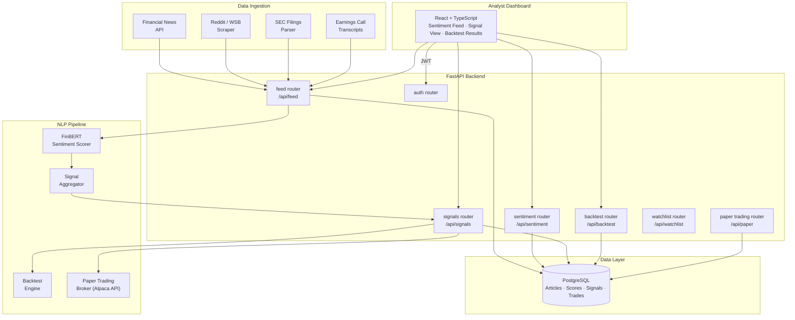

# Atlas

**Real-Time Market Sentiment & Trading Intelligence Platform**

[**🔗 View Live Preview →**](https://www.perplexity.ai/computer/a/atlas-preview-project-2-of-9-lCA5DWRgQoa4AN6VYPXAUQ)

> A production-style market sentiment and trading intelligence platform that aggregates financial news and social signals, scores sentiment with an NLP pipeline, generates trade signals, and surfaces insights on a live analyst dashboard.

---

## 🎯 What I Built & Why

Sentiment is one of the most persistent alpha sources in quantitative finance, but translating raw text signals into tradeable intelligence is non-trivial. I built Atlas to work through the complete pipeline:

- **Multi-source ingestion** — financial news, Reddit/WSB, SEC filings, and earnings call transcripts — because single-source sentiment is easy to game and slow to react
- **NLP sentiment scoring** — FinBERT-style financial domain scoring, not generic VADER, since financial language has domain-specific sentiment polarity
- **Signal generation & backtesting** — sentiment signals are turned into directional trade signals and validated against historical price data to measure whether they actually produced alpha
- **Paper trading mode** — signals feed into a simulated broker API (Alpaca-compatible) for end-to-end validation without real capital

---

## 🏗️ Architecture



---

## 📷 Features

- **Multi-source ingestion** — financial news, Reddit/WSB, SEC filings, earnings call transcripts
- **FinBERT sentiment scoring** — financial domain NLP model, not generic sentiment tools
- **Trade signal generation** — directional signals with confidence thresholds
- **Backtesting engine** — historical signal validation against price data
- **Paper trading mode** — Alpaca-compatible simulated broker execution
- **Live analyst dashboard** — sentiment feed, signal view, and backtest results
- **Watchlist management** — per-user ticker tracking with alert thresholds

---

## 🛠️ Tech Stack

| Layer | Technology |
|---|---|
| Backend API | FastAPI + SQLAlchemy + PostgreSQL |
| NLP | Transformers (FinBERT) + spaCy |
| Backtesting | Pandas + NumPy |
| Paper Trading | Alpaca API (paper mode) |
| Frontend | React + Vite + TypeScript |
| Infra | Docker Compose + GitHub Actions CI |

---

## 🚀 Quick Start

```bash
docker compose up --build
# Backend API docs: http://localhost:8000/docs
# Frontend:         http://localhost:5173
```

### Local Development
```bash
cd backend && pip install -e .[dev]
cp .env.example .env
uvicorn app.main:app --reload

cd frontend && npm ci && npm run dev
```

### Quality Checks
```bash
make lint && make test
```

---

## 🗂️ Repository Structure

```
backend/    FastAPI API, NLP sentiment pipeline, signal engine, backtest, paper trading, tests
frontend/   React analyst dashboard
docs/       Architecture, signal methodology, backtest results
```

---

## 📝 Key Learnings

- Financial domain NLP models (FinBERT) meaningfully outperform general sentiment tools — words like "risk", "gain", and "return" carry opposite polarity in financial vs. general contexts
- Backtesting sentiment signals against historical price data is essential before trusting them — many sentiment features produce spurious correlations that don't survive out-of-sample testing
- Multi-source aggregation is more robust than single-source; source-specific biases cancel out when you aggregate across news, social, and filings

---

## 📄 License

MIT
