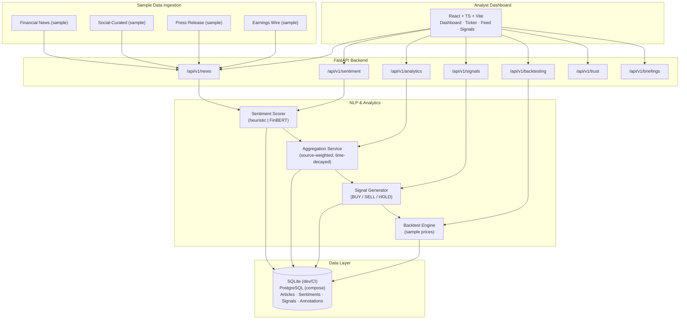

# Atlas — Market Sentiment & Trading Intelligence Platform

**A student-built FinTech analytics platform that ingests sample market news, scores ticker-level sentiment with an NLP pipeline, aggregates time-series signals, and runs historical comparison / backtest-style analytics on a React dashboard.**

[**🔗 View Live Preview →**](https://www.perplexity.ai/computer/a/atlas-preview-project-2-of-9-lCA5DWRgQoa4AN6VYPXAUQ)

> ⚠️ **Disclaimer — for education and portfolio demonstration only.** Atlas is an analytics learning project. It does **not** execute real trades, does **not** connect to live brokerage accounts, does **not** make investment recommendations, and is **not** financial advice. All "signals," "backtests," and "paper trades" run on deterministic sample data so the demo is reproducible.

---

## 👤 Recruiter Summary

**Project type:** Full-stack FinTech / NLP portfolio project
**Builder:** Ryan Bush — University of Maryland, Information Science (General Business minor; previous Electrical Engineering coursework)
**Stack:** Python · FastAPI · SQLAlchemy · pandas · NumPy · scikit-learn (sentiment heuristics + optional Transformers/FinBERT) · React · Vite · TypeScript · Tailwind · pytest · GitHub Actions · Docker Compose
**What it shows:** end-to-end design of a financial analytics pipeline — multi-source ingestion → NLP sentiment scoring → ticker-level aggregation → time-series analytics → backtest-style historical comparison → API + dashboard → CI + tests.
**Honest scope:** sample/synthetic data, no real trading, no production deployment, deterministic heuristics by default so recruiters can reproduce results offline.

---

## 🧭 Problem & Value

Financial market news arrives faster than humans can read it, and sentiment in financial text is domain-specific — words like *risk*, *gain*, and *contraction* carry different polarity than in general English. Atlas demonstrates the **end-to-end shape** of a sentiment-to-signal analytics pipeline you'd find inside a quant research team's tooling:

- A way to **standardize multi-source text** (financial news, social, press releases, earnings wire) into one schema.
- A **finance-aware scoring layer** that supports both a deterministic lexicon heuristic (reproducible) and an optional FinBERT-style Transformers model (richer signal).
- A **ticker-level aggregation + signal layer** that turns scores into a BUY/SELL/HOLD label with confidence, weighting, and an audit trail.
- A **backtest-style historical comparison module** that walks scored sentiment against forward-period returns on sample price data to estimate hypothetical signal expectancy — purely for educational evaluation of the pipeline, not for investment use.
- A **dashboard** that makes the whole flow legible to a non-engineer.

---

## ✨ Features

- **Multi-source ingestion** — financial news, social-curated, press release, earnings wire, and price stubs unified under one schema.
- **Sentiment scoring pipeline** — finance-tuned lexicon heuristic (default, fully reproducible) plus optional FinBERT Transformers backend; both expose label, score, confidence, topics, events, entity sentiment, and cluster ID.
- **Ticker-level aggregation** — rolling, source-weighted sentiment, breadth, volatility, and trend per ticker with a cache layer.
- **Signal generation** — BUY/SELL/HOLD with configurable thresholds, min-confidence gate, and a rationale string for explainability.
- **Backtest-style historical comparison** — replay signals against sample forward returns, with expectancy, confusion matrix, correlation, and scenario sweeps.
- **"Paper" simulation** — purely educational portfolio simulation against synthetic prices; not real trading.
- **Trust & audit** — per-signal top contributors, analyst annotations, and an audit log.
- **Briefings** — auto-generated ticker briefings and watchlist recaps.
- **Live dashboard** — React + Vite + TypeScript multi-page UI (Dashboard, Ticker, News Feed, Signals) with a fallback mock data layer for resilient offline demos.
- **CI** — GitHub Actions runs ruff lint, pytest, and the frontend build on every PR.

---

## 🛠️ Tech Stack

| Layer | Technology |
|---|---|
| Backend API | FastAPI, SQLAlchemy 2.x, Pydantic v2 |
| NLP | Finance-tuned lexicon heuristic (default) · optional Transformers / FinBERT |
| Analytics | pandas, NumPy, scikit-learn (lightweight) |
| Storage | SQLite for local/dev/CI · PostgreSQL via Docker for full stack |
| Frontend | React, Vite, TypeScript, Tailwind |
| Tests | pytest, FastAPI TestClient, in-memory SQLite |
| Tooling | ruff · GitHub Actions · Docker Compose · Makefile |

---

## 🏗️ Architecture



---

## 📁 Repository Structure

```
.
├── backend/                  # FastAPI app
│   ├── app/
│   │   ├── api/v1/routers/   # news, sentiment, analytics, signals, backtesting, trust, briefings, jobs, replay, streaming
│   │   ├── services/         # nlp, aggregation, signal, backtest, news, weighting, trust, briefing, cache, jobs, replay, stream
│   │   ├── models/           # SQLAlchemy: news, sentiment, signal, annotation, ingestion, price
│   │   ├── schemas/          # Pydantic request/response DTOs
│   │   ├── core/             # config, logging, middleware
│   │   └── db/               # engine, session, base
│   ├── scripts/seed_demo.py  # deterministic demo seeding
│   ├── tests/                # pytest: pipeline, coverage gaps, health
│   ├── requirements.txt
│   └── Dockerfile
├── frontend/                 # React + Vite + TypeScript dashboard
├── data/                     # Sample news + price fixtures (synthetic)
├── docs/
│   ├── architecture.md       # Component & flow detail
│   ├── api.md                # API reference with curl examples
│   ├── codebase-overview.md
│   ├── demo-runbook.md
│   └── resume-bullets.md     # ATS-ready resume bullets
├── scripts/
│   └── run_demo.sh           # One-shot end-to-end local demo
├── .github/workflows/ci.yml
├── docker-compose.yml
├── Makefile
└── README.md
```

---

## 🚀 Quick Start

### Option A — Local (recommended for recruiters)

```bash
# 1. Install backend deps
cd backend
pip install -r requirements.txt

# 2. Run tests (uses in-memory SQLite, deterministic heuristic NLP)
NLP_PROVIDER=heuristic DATABASE_URL="sqlite:///:memory:" PYTHONPATH=. pytest -q

# 3. Run the API locally against SQLite
NLP_PROVIDER=heuristic DATABASE_URL="sqlite:///./atlas.db" AUTO_CREATE_TABLES=true \
  PYTHONPATH=. uvicorn app.main:app --reload --port 8000

# 4. Browse the auto-generated docs
open http://localhost:8000/docs
```

### Option B — Full stack via Docker Compose

```bash
docker compose up --build
# Backend:  http://localhost:8000/docs
# Frontend: http://localhost:5173
```

### Frontend dev server

```bash
cd frontend
npm ci && npm run dev
```

---

## ⚙️ Environment Variables

Copy `backend/.env.example` to `backend/.env` and adjust:

| Variable | Default | Purpose |
|---|---|---|
| `APP_NAME` | `Atlas API` | App display name |
| `API_V1_PREFIX` | `/api/v1` | API base prefix |
| `DATABASE_URL` | _(empty → builds Postgres URL)_ | Override with `sqlite:///./atlas.db` for local |
| `NLP_PROVIDER` | `heuristic` | `heuristic` (deterministic) or `transformers` (FinBERT) |
| `NLP_MODEL_NAME` | `ProsusAI/finbert` | HuggingFace model id when `transformers` is selected |
| `AUTO_CREATE_TABLES` | `false` | Auto-create SQLAlchemy tables on startup (dev only) |
| `DEFAULT_BUY_THRESHOLD` | `0.25` | Default signal threshold |
| `DEFAULT_SELL_THRESHOLD` | `-0.25` | Default signal threshold |
| `SENTIMENT_HALF_LIFE_HOURS` | `6.0` | Time-decay window for aggregation |

---

## 🎬 Demo Workflow

```bash
# From repo root
bash scripts/run_demo.sh
```

Or step-by-step against a running API:

```bash
# 1. Ingest a deterministic batch of sample news across 2 tickers
curl -s -X POST http://localhost:8000/api/v1/news/ingest \
  -H 'Content-Type: application/json' \
  -d '{"tickers":["AAPL","TSLA"],"limit_per_ticker":2,"sources":["financial_news","social_curated"],"mode":"historical_backfill","lookback_days":7}'

# 2. Score a custom headline
curl -s -X POST http://localhost:8000/api/v1/sentiment/analyze \
  -H 'Content-Type: application/json' \
  -d '{"ticker":"AAPL","source":"earnings_wire","headline":"Apple beats estimates and raises guidance","body":"Margin expansion across products."}'

# 3. Get aggregated ticker view
curl -s http://localhost:8000/api/v1/analytics/ticker/AAPL

# 4. Get the current signal
curl -s "http://localhost:8000/api/v1/signals/ticker/AAPL?buy_threshold=0.1&sell_threshold=-0.1&min_confidence=0.1"

# 5. Run a backtest-style historical comparison
curl -s -X POST http://localhost:8000/api/v1/backtesting \
  -H 'Content-Type: application/json' \
  -d '{"ticker":"AAPL","start_date":"2025-04-01","end_date":"2025-05-01","buy_threshold":0.1,"sell_threshold":-0.1,"min_confidence":0.1}'
```

A complete walkthrough lives in [`docs/demo-runbook.md`](docs/demo-runbook.md), and a full API reference is in [`docs/api.md`](docs/api.md).

---

## 🧪 Sample Data

`data/` ships small, synthetic, deterministic fixtures so anyone can reproduce the pipeline without API keys or licensed market data:

- `data/sample_news.json` — sample financial news headlines + bodies across AAPL, MSFT, TSLA, NVDA, AMZN, tagged by source.
- `data/sample_prices.csv` — synthetic daily OHLC bars used by the backtest module for historical comparison.
- `data/README.md` — schema, units, and an explicit note that these prices are **synthetic and not real market data**.

The production ingestion service generates richer in-memory fixtures at runtime so tests stay hermetic.

---

## 🧠 NLP & Sentiment Workflow

1. **Compose** — headline + body → unified text.
2. **Score** — heuristic or FinBERT returns label (positive/neutral/negative) and a 0–1 confidence.
3. **Finance-confidence adjustment** — reweight raw score by counts of finance-positive, finance-negative, and uncertainty terms.
4. **Topic + event extraction** — keyword routing into `earnings`, `macro`, `product`, `legal`, `m_and_a`.
5. **Entity sentiment** — uppercase token sweep with directional projection.
6. **Cluster ID** — hash of topic set for downstream grouping.
7. **Persist + aggregate** — source-weighted, time-decayed rolling stats per ticker.

See [`backend/app/services/nlp_service.py`](backend/app/services/nlp_service.py) and [`backend/app/services/aggregation_service.py`](backend/app/services/aggregation_service.py).

---

## 📈 Backtest-Style Historical Comparison

The backtest module is **not** a production trading backtester. It is an educational tool that:

- Walks scored sentiment for a ticker between two dates against synthetic forward returns.
- Reports expectancy, average return per trade, cumulative proxy return vs benchmark, a confusion matrix (signal vs realized direction), and return correlation.
- Supports threshold sweeps (`/backtesting/tune`) and named scenarios (conservative/balanced/aggressive).
- Includes a `paper-trade` mode that simulates portfolio NAV against synthetic prices.

Every backtest response includes an explicit `assumptions` block listing the simplifications.

---

## ✅ Testing

```bash
cd backend
NLP_PROVIDER=heuristic DATABASE_URL="sqlite:///:memory:" PYTHONPATH=. pytest -q
```

Current suite (22 tests, all passing):

- Ingestion → sentiment → aggregation → signal end-to-end pipeline
- Ticker drilldown, metrics, overview, events, clusters, article table
- Backtest, threshold tuning, scenarios, paper-trade
- Watchlist signals and alerts
- Trust explanations, annotations, audit, briefings
- Sentiment fallback scoring (deterministic lexicon)
- Multi-source ingestion with duplicate skipping
- Jobs, replay, streaming, health/readiness, request-id tracing

CI runs `ruff check` + `pytest` on the backend and `npm run build` on the frontend for every push and PR.

---

## 🔒 Limitations & Future Work

**Limitations (today)**

- Sample/synthetic data only — no live market data, no real news API contract.
- No real broker integration; "paper trading" is an in-memory portfolio simulation.
- Heuristic NLP is the default for reproducibility; FinBERT is supported but optional.
- No authentication, multi-tenancy, or rate-limit enforcement.
- Not deployed to any public environment.

**Planned / future**

- Pluggable real news connectors (e.g., a free-tier provider) behind the same `news_service` interface.
- Persistent vector store for article similarity / dedupe.
- True walk-forward backtester with transaction costs and slippage.
- Auth (FastAPI Users) + per-user watchlists in the DB.
- Streamlit/Dash mini-dashboard as a lighter alternative to the React app.
- Model evaluation harness comparing heuristic vs FinBERT vs a fine-tuned head on a labelled set.

---

## 💼 Resume Bullets

ATS-friendly one-line bullets — see [`docs/resume-bullets.md`](docs/resume-bullets.md) for the full set.

- Built Atlas, a full-stack FinTech analytics platform that ingests sample financial news, scores ticker-level sentiment with an NLP pipeline, and visualizes signals on a React dashboard.
- Designed a FastAPI backend with 11+ versioned routers (news, sentiment, analytics, signals, backtesting, trust, briefings) backed by SQLAlchemy and 22 passing pytest tests.
- Implemented a dual NLP layer (deterministic finance lexicon + optional FinBERT/Transformers) producing label, confidence, topics, events, and entity-level sentiment per article.
- Built a source-weighted, time-decayed aggregation service that turns per-article sentiment into rolling ticker-level signals with BUY/SELL/HOLD logic and an audit trail.
- Implemented a backtest-style historical comparison module with expectancy, confusion matrix, return correlation, threshold tuning, and scenario sweeps on sample price data.
- Shipped a React + Vite + TypeScript analyst dashboard with KPI cards, sentiment composition bars, ticker drilldown, signal explainability, and a resilient mock-data fallback layer.
- Set up GitHub Actions CI to run ruff lint, pytest, and the frontend production build on every PR.

---

## 🏷️ GitHub Topics

Suggested topics for discoverability:
`fintech` · `sentiment-analysis` · `nlp` · `market-data` · `time-series` · `fastapi` · `python` · `financial-analytics` · `portfolio-project` · `react` · `typescript` · `backtesting`

---

## 📄 License

MIT — see [LICENSE](LICENSE).

---

## 🙋 About

Built by **Ryan Bush**, an Information Science student at the University of Maryland with a General Business minor and previous Electrical Engineering coursework, as a portfolio piece exploring the intersection of NLP, financial analytics, and full-stack engineering.

> Educational project only — not financial advice, not a trading system.
